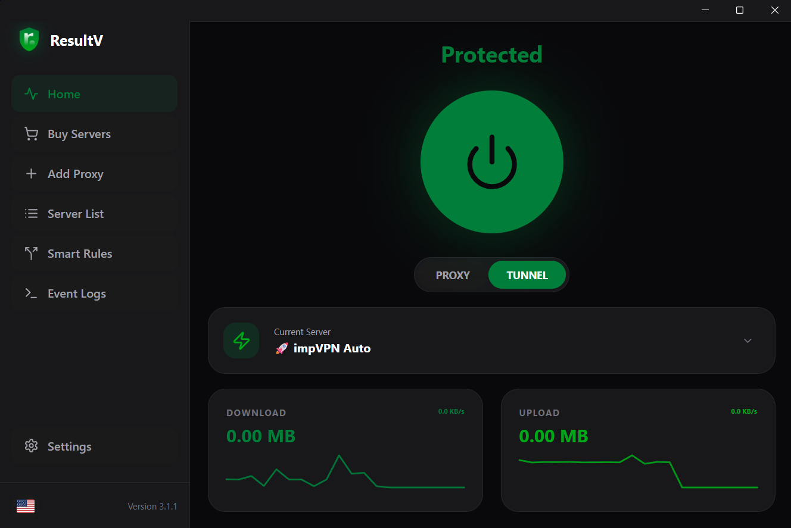
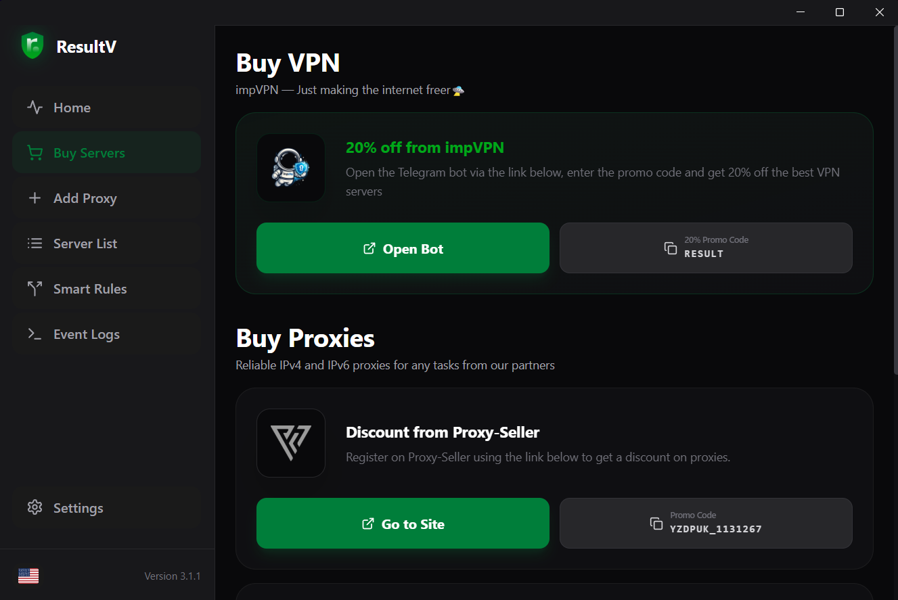
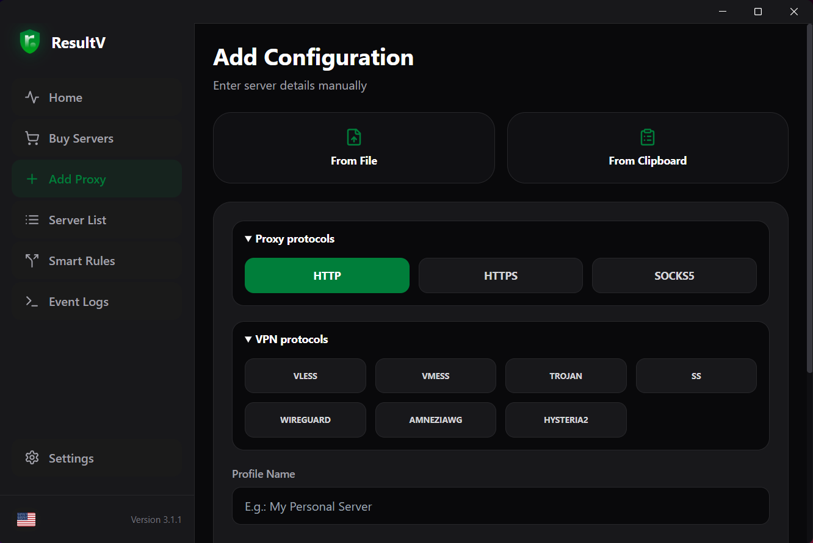
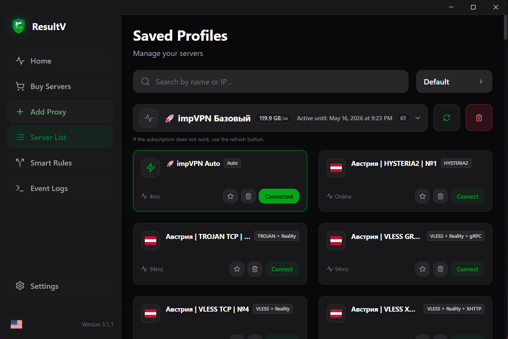
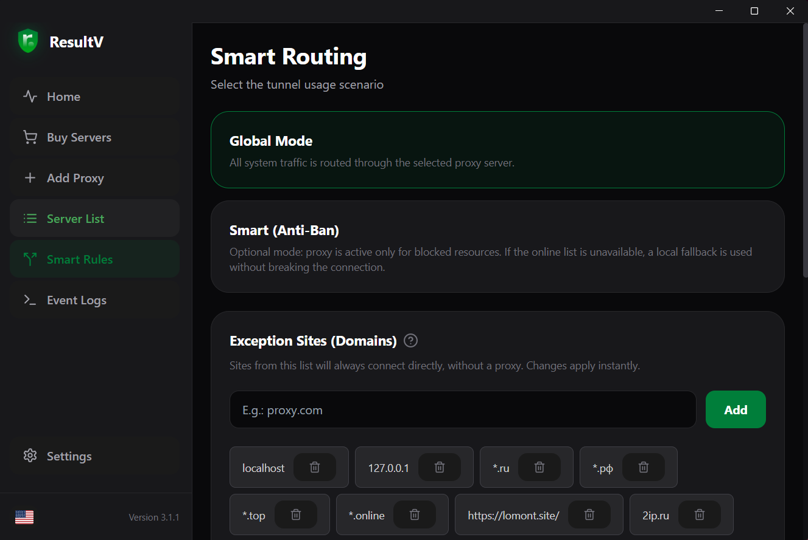
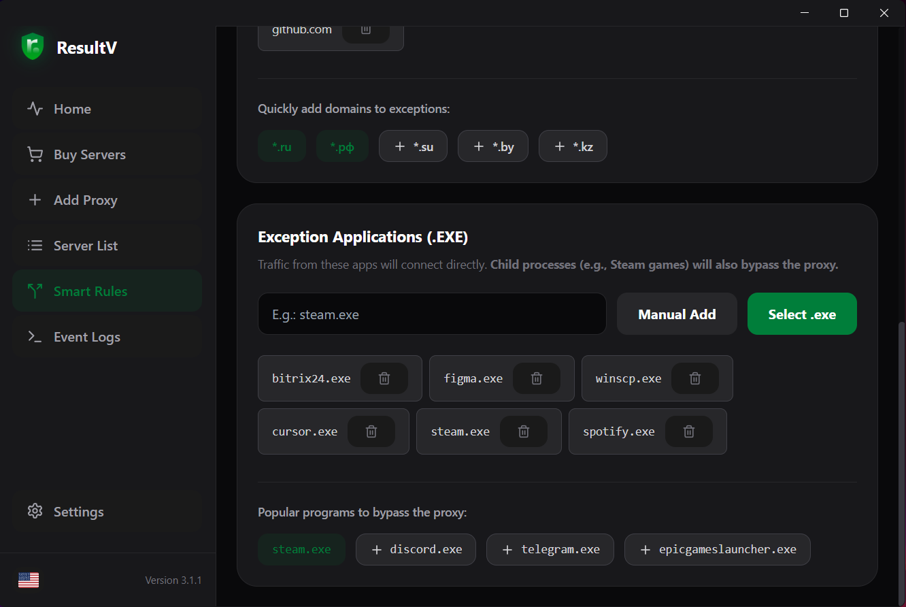
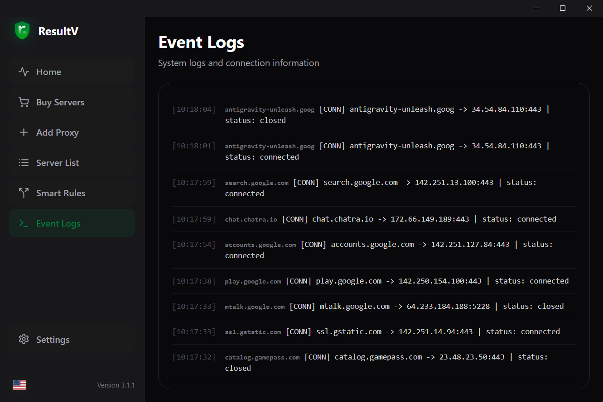
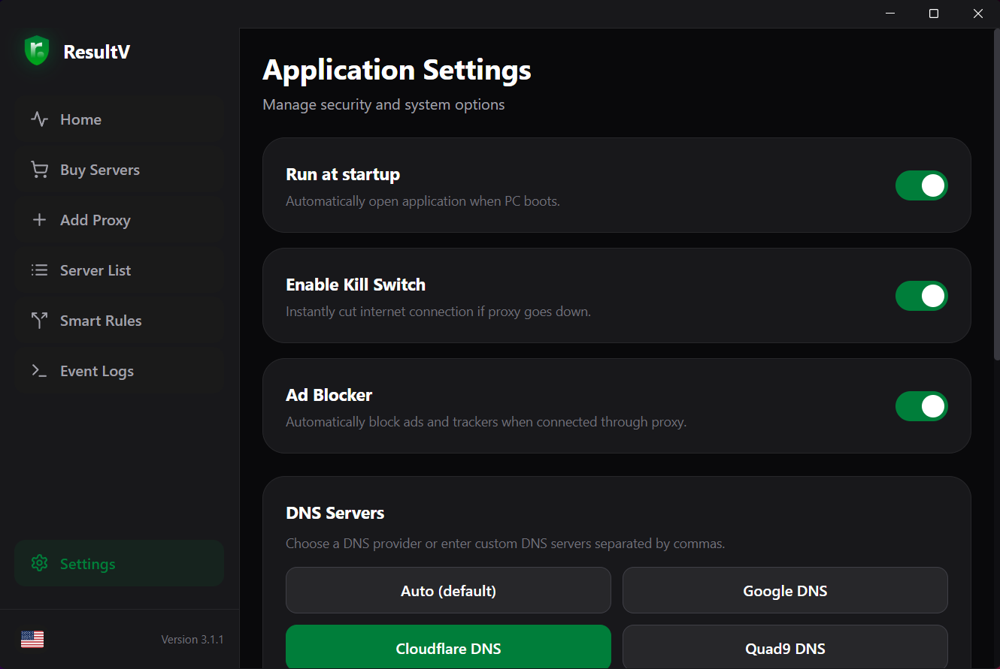
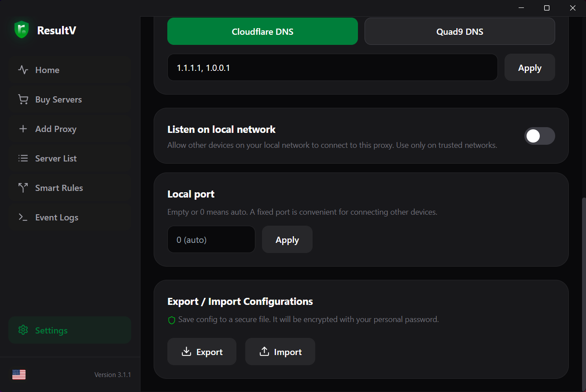

<p align="center">
  
</p>

<h1 align="center">ResultV (prev. ResultProxy)</h1>

<p align="center">
  <b>Desktop VPN and proxy client for Windows (macOS/Linux support in beta): Wails, Go, and sing-box.</b><br>
  Routing, subscriptions, smart rules, and system integration in one app.
</p>

<p align="center">
  
  
  
  
  
</p>

<p align="center">
  <a href="#features">Features</a> •
  <a href="#user-guide">User guide</a> •
  <a href="#development">Development</a> •
  <a href="#building">Building</a> •
  <a href="https://result-proxy.ru/">Website</a>
</p>

<p align="center">
  <a href="./README.md">Русский</a> | <b>English</b>
</p>

---

## Overview

ResultV **3.1.2** is a native desktop application built with **[Wails v2](https://wails.io/)**. The UI is **React 18** with **Vite** and **Tailwind CSS**; traffic is handled by a **Go** backend and **[sing-box](https://github.com/SagerNet/sing-box)** (with project-specific build tags in `wails.json`). The interface is localized with **i18next** (English and Russian).

**Prebuilt releases:** GitHub Actions publishes **Windows amd64** artifacts (portable `.exe` and NSIS installer), **macOS** (`.dmg`) and **Linux** (`.AppImage`, `.deb`, `.rpm`) when a `v*` tag is pushed.

---

## Features

- **Proxy** and **Tunnel (TUN)** modes for system-wide routing where applicable
- **Protocols:** HTTP, HTTPS, SOCKS5, **VLESS**, **VMESS**, **Trojan**, **Shadowsocks**, **WireGuard**, **AmneziaWG**, **Hysteria2**
- **Subscriptions:** add, refresh, remove URL; grouping by provider/country where metadata is available
- **Import:** paste from clipboard or bulk import from `.txt` / `.csv` / `.conf`
- **Smart rules:** Global and Smart modes; **domain** and **application** exclusions (nested rules supported in the engine)
- **Kill Switch**, optional **ad blocking**, **autostart**
- **Encrypted export/import** of configuration (password-protected)
- **Logs** view (UI and backend messages)
- **System tray** integration;
- **Update check** against `update.json` on GitHub (see [Updates](#updates))

---

## Supported protocols and constraints

| Category | Protocols |
|----------|-----------|
| Classic proxy | HTTP, HTTPS, SOCKS5 |
| VPN stack (sing-box) | VLESS, VMESS, Trojan, SS, WireGuard, AmneziaWG, Hysteria2 |

**Important:**

- **WireGuard** and **AmneziaWG** work only in **Tunnel** mode; they are unavailable in Proxy mode (checked in `internal/proxy/manager.go`).
- **AmneziaWG 2.0** — full set of obfuscation fields: classic `Jc/Jmin/Jmax`, packet sizes `S1–S4`, headers `H1–H4`, special junk `I1–I5` + `Itime`, handshake junk `J1–J3`. In the UI they can be set in a structured editor (AmneziaWG tab) or in "Raw JSON" mode. URIs of the form `awg://...?Jc=5&Jmin=10&Jmax=50&S1=16&I1=...&J1=...&Itime=300` are accepted (both lower and upper case — AmneziaVPN clients provide `Jc/Jmin/...`).
- Subscriptions in **JSON** (Xray format with `outbounds[]` and sing-box format with `type`) are parsed for all key protocols, including `wireguard`/`amneziawg` with an `amnezia` block.
- **Tunnel** mode on Windows requires **running as Administrator**.
- **Kill Switch** on Windows may require **administrator privileges** for firewall rules (`internal/system/killswitch_windows.go`).
- Some subscription providers enforce **HWID device limits**; the app sends a stable `x-hwid` when fetching subscriptions and shows the reason if the provider returned an empty response due to the limit.
- **In case of issues**, please contact TG @resultpoint_manager.

---

## User guide

Screenshots below show the **English** UI (files in [`docs/images/readme/`](./docs/images/readme/)).

### Home

Connect and disconnect, choose **Proxy** / **Tunnel** mode, switch servers, and see traffic summaries when connected.

<p align="center">
  
</p>

### Buy proxy

The **Buy** tab links to partner offers ([impVPN:telegram](https://t.me/impVPNBot?start=NzQ3MDczMjUz)), ([impVPN:site](https://my.impio.space/?ref=NzQ3MDczMjUz)) - Best VPN servers at affordable prices, and with the promo code **result** a 20% bonus to the balance top-up. You can skip this step if you already have a server or a subscription.

<p align="center">
  
</p>

### Add server or subscription

Manual input, pasting **subscription links** and share-links, bulk import from clipboard or files.

<p align="center">
  
</p>

### Proxy list

Server cards, **ping**, editing and deleting, working with groups from **subscriptions**, adding servers to favorites.

<p align="center">
  
</p>

### Smart rules

**Global** and **Smart** modes; exclusion tabs by **sites** (e.g. `*.example.com`) and by **applications**.

<p align="center">
  
</p>
<p align="center">
  
</p>

### Logs

Inspect connection and routing messages to diagnose issues.

<p align="center">
  
</p>

### Settings

**Autostart**, **Kill Switch**, **ad blocking**, **custom DNS**, **listening to local network and setting a local port**, password-protected **export/import**.

<p align="center">
  
</p>
<p align="center">
  
</p>

---

## Updates

The app version is taken from the embedded `wails.json` / `GetVersion` and compared with the remote [`update.json`](https://raw.githubusercontent.com/AandStep/ResultProxy/main/update.json). Release metadata and notes are maintained in the root [`update.json`](./update.json).

---

## Development

### Prerequisites

- **Go:** version compatible with [`go.mod`](./go.mod) (see `go` and `toolchain` directives)
- **Node.js:** **20+** recommended (CI uses **24** for releases)
- **Wails CLI v2:** `go install github.com/wailsapp/wails/v2/cmd/wails@latest`
- **Windows:** WebView2 runtime (usually present on current Windows 10/11)

### Run in dev mode

From the repository root:

```bash
wails dev
```

This starts the Vite dev server with hot reload and connects it to the Go backend.

---

## Building

### Local production build

```bash
wails build
```

Add `-nsis` on Windows to produce an installer if NSIS is installed:

```bash
wails build -nsis
```

Outputs land under `build/bin/` (see [`build/README.md`](./build/README.md)).

### CI releases

The [`.github/workflows/release.yml`](./.github/workflows/release.yml) workflow runs `wails build -clean -nsis -platform windows/amd64` and publishes GitHub Release assets.

---

## Tech stack

| Layer | Technology |
|-------|------------|
| Shell | [Wails v2](https://wails.io/) |
| UI | React 18, Vite, Tailwind CSS, i18next |
| Backend | Go |
| Proxy core | sing-box (see `go.mod` and replace directives), project build tags in [`wails.json`](./wails.json) |
| Tray | getlantern/systray (platform-specific code under `internal/getlantern_systray/`) |

---

## License

This project is licensed under the **GNU General Public License v3.0** — see [`LICENSE`](./LICENSE).

---

**Website and downloads:** [https://result-proxy.ru/](https://result-proxy.ru/)
