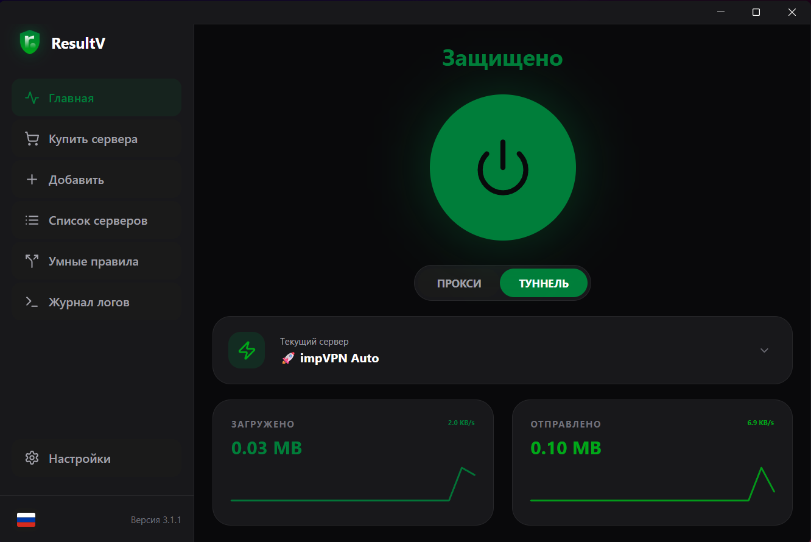
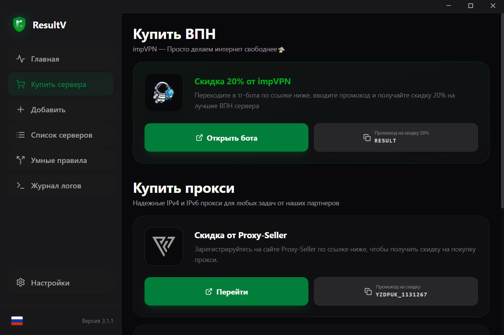
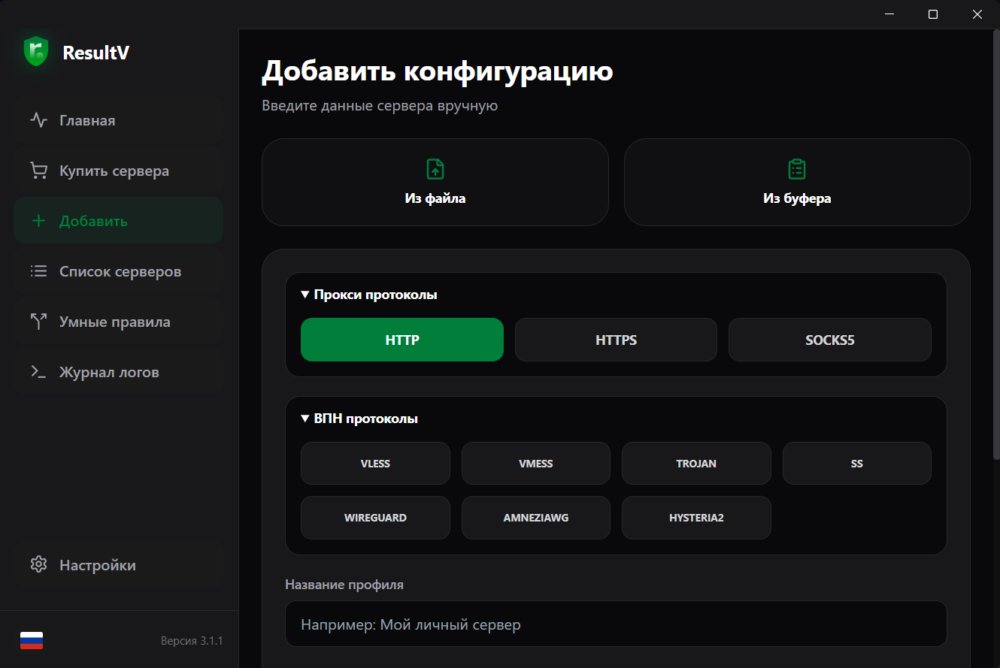
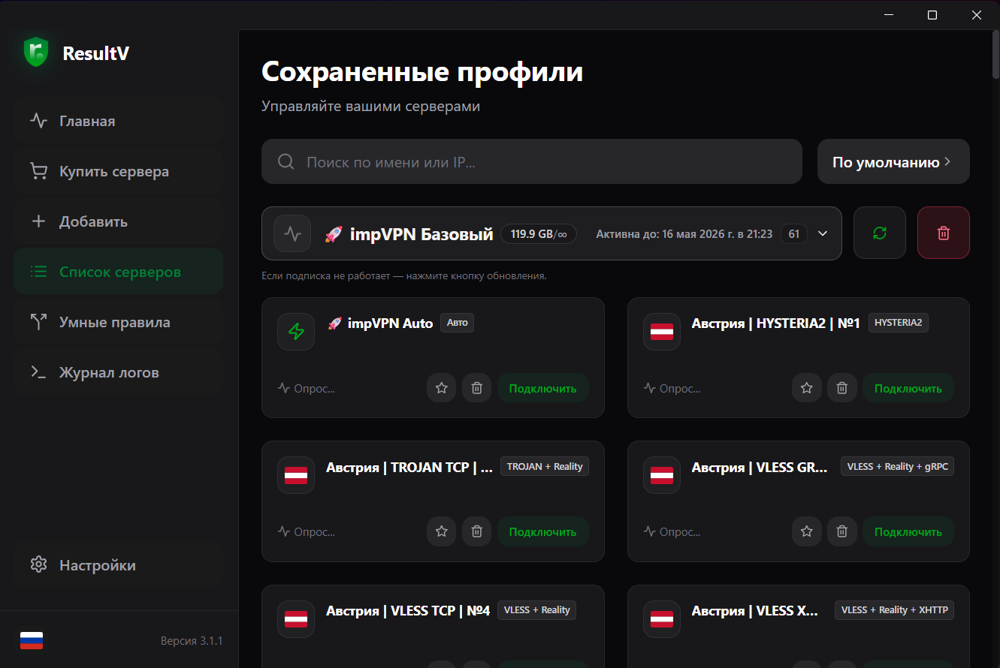
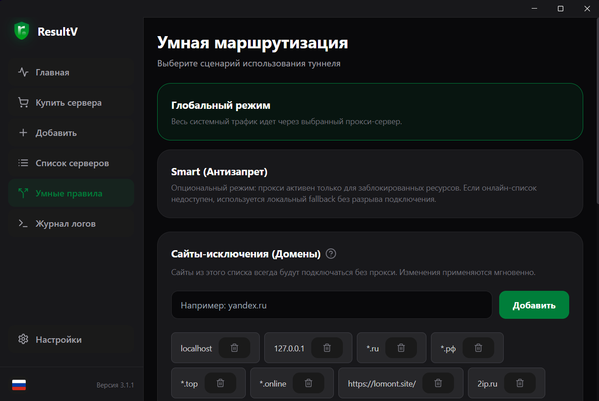
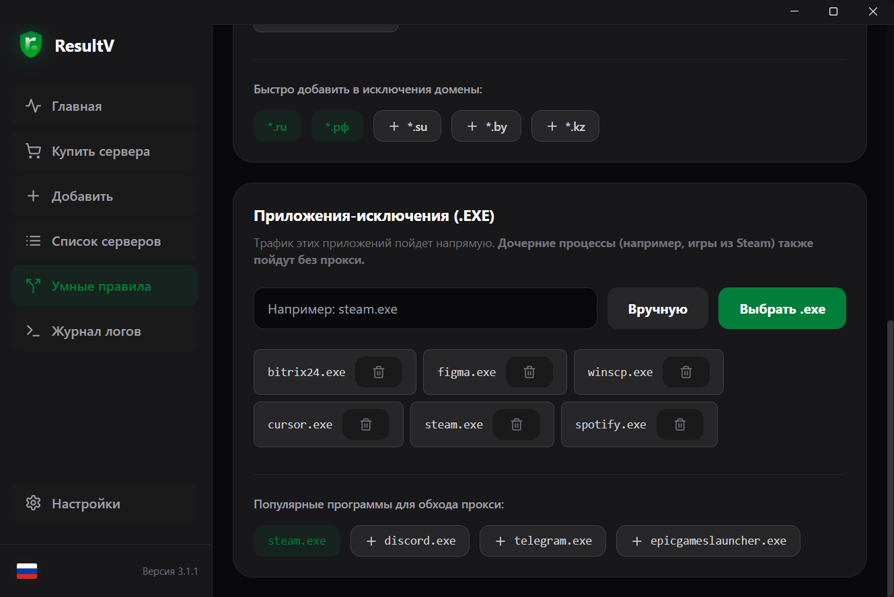
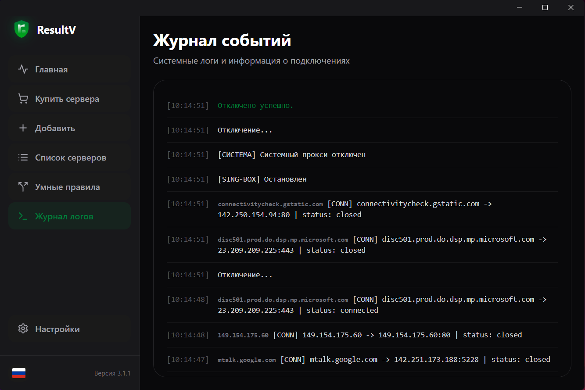
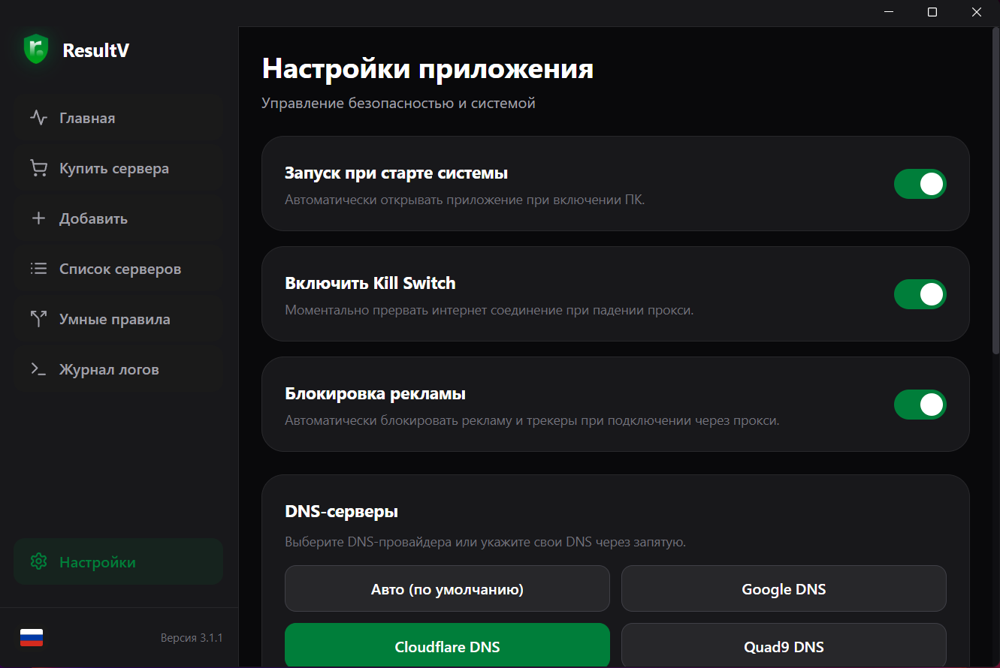
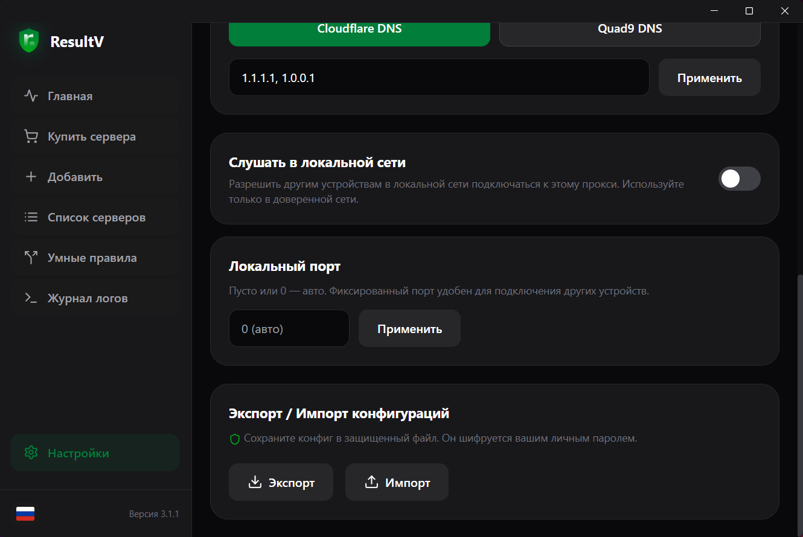

<p align="center">
  
</p>

<h1 align="center">ResultV (ранее ResultProxy)</h1>

<p align="center">
  <b>Настольный клиент для ВПН и прокси на Windows (поддержка macOS/Linux в бета тесте): Wails, Go и sing-box.</b><br>
  Маршрутизация, подписки, умные правила и интеграция с системой в одном приложении.
</p>

<p align="center">
  
  
  
  
  
</p>

<p align="center">
  <a href="#возможности">Возможности</a> •
  <a href="#руководство-пользователя">Руководство</a> •
  <a href="#разработка">Разработка</a> •
  <a href="#сборка">Сборка</a> •
  <a href="https://result-proxy.ru/">Сайт</a>
</p>

<p align="center">
  <b>Русский</b> | <a href="./README.en.md">English</a>
</p>

---

## О проекте

ResultV **3.1.2** — нативное настольное приложение на **[Wails v2](https://wails.io/)**. Интерфейс: **React 18**, **Vite**, **Tailwind CSS**; трафик обрабатывает бэкенд на **Go** и движок **[sing-box](https://github.com/SagerNet/sing-box)** (теги сборки заданы в `wails.json`). Локализация через **i18next** (русский и английский).

**Готовые сборки:** в GitHub Actions публикуются артефакты **Windows amd64** (portable `.exe` и установщик NSIS), **macOS** (`.dmg`) и **Linux** (`.AppImage`, `.deb`, `.rpm`) при push тега `v`*.

---

## Возможности

- Режимы **Proxy** и **Tunnel (TUN)** для системной маршрутизации там, где это применимо
- Протоколы: HTTP, HTTPS, SOCKS5, **VLESS**, **VMESS**, **Trojan**, **Shadowsocks**, **WireGuard**, **AmneziaWG**, **Hysteria2**
- **Подписки:** добавление, обновление, удаление URL; группировка по провайдеру/стране при наличии данных
- **Импорт:** вставка из буфера обмена или массовый импорт из `.txt` / `.csv` / `.conf`
- **Умные правила:** режимы Global и Smart; исключения по **доменам** и **приложениям** (в движке поддерживаются вложенные правила)
- **Kill Switch**, опционально **блокировка рекламы**, **автозапуск**
- **Зашифрованный экспорт/импорт** конфигурации (пароль к данным)
- Экран **логов** (сообщения UI и бэкенда)
- Работа из **системного трея**; 
- **Проверка обновлений** по `update.json` на GitHub (см. [Обновления](#updates))

---

## Протоколы и ограничения


| Категория           | Протоколы                                                 |
| ------------------- | --------------------------------------------------------- |
| Классический прокси | HTTP, HTTPS, SOCKS5                                       |
| VPN-стек (sing-box) | VLESS, VMESS, Trojan, SS, WireGuard, AmneziaWG, Hysteria2 |


**Важно:**

- **WireGuard** и **AmneziaWG** работают только в режиме **Tunnel**, в режиме Proxy недоступны (проверка в `internal/proxy/manager.go`).
- **AmneziaWG 2.0** — полный набор полей обфускации: классические `Jc/Jmin/Jmax`, размеры `S1–S4`, заголовки `H1–H4`, специальные джанки `I1–I5` + `Itime`, рукопожатие-джанки `J1–J3`. В UI их можно задавать в структурированном редакторе (вкладка AmneziaWG) либо в режиме «Raw JSON». Принимаются URI вида `awg://...?Jc=5&Jmin=10&Jmax=50&S1=16&I1=...&J1=...&Itime=300` (как в нижнем, так и в верхнем регистре — клиенты AmneziaVPN отдают `Jc/Jmin/...`).
- Подписки в **JSON** (Xray-формат с `outbounds[]` и sing-box-формат с `type`) разбираются для всех ключевых протоколов, включая `wireguard`/`amneziawg` с блоком `amnezia`.
- Режим **Tunnel** в Windows требует **запуска от имени администратора**.
- **Kill Switch** в Windows может требовать **прав администратора** для правил брандмауэра (`internal/system/killswitch_windows.go`).
- Некоторые провайдеры подписок используют **HWID-ограничение устройств**; приложение передает стабильный `x-hwid` при загрузке подписок и показывает причину, если провайдер вернул пустой ответ по лимиту.
- **При сбоях** просьба писать в ТГ @resultpoint_manager.

---

## Руководство пользователя

Скриншоты ниже показывают **русский** интерфейс (файлы в [`docs/images/readme/`](./docs/images/readme/)).


### Главная

Подключение и отключение, выбор режима **Proxy** / **Tunnel**, переключение серверов, сводка трафика при активном соединении.

<p align="center">
  
</p>


### Купить прокси

Вкладка **Купить** ведёт на партнёрские предложения ([impVPN:telegram](https://t.me/impVPNBot?start=NzQ3MDczMjUz)), ([impVPN:site](https://my.impio.space/?ref=NzQ3MDczMjUz)) - Лучшие ВПН сервера по доступным ценам, а по промокоду **result** бонус 20% к пополнению баланса. Если у вас уже есть сервер или подписка, шаг можно пропустить.

<p align="center">
  
</p>


### Добавить сервер или подписку

Ручной ввод, вставка **ссылок подписки** и share-ссылок, массовый импорт из буфера или файлов.

<p align="center">
  
</p>


### Список прокси

Карточки серверов, **пинг**, редактирование и удаление, работа с группами от **подписок**, добавление серверов в избранное.

<p align="center">
  
</p>


### Умные правила

Режимы **Global** и **Smart**; вкладки исключений по **сайтам** (например `*.example.com`) и по **приложениям**.

<p align="center">
  
</p>
<p align="center">
  
</p>


### Логи

Просмотр сообщений для диагностики подключения и маршрутизации.

<p align="center">
  
</p>


### Настройки

**Автозапуск**, **Kill Switch**, **блокировка рекламы**, **кастомные DNS**, **слушание локальной сети и выставление локального порта** **экспорт/импорт** с паролем.

<p align="center">
  
</p>
<p align="center">
  
</p>


---

## Обновления

Версия приложения берётся из встроенного `wails.json` / `GetVersion` и сравнивается с удалённым `[update.json](https://raw.githubusercontent.com/AandStep/ResultProxy/main/update.json)`. Текст релиза и номер версии для ленты обновлений дублируются в корневом `[update.json](./update.json)`.

---

## Разработка

### Требования

- **Go:** совместимый с `[go.mod](./go.mod)` (директивы `go` и `toolchain`)
- **Node.js:** **20+** (в CI для релизов используется **24**)
- **Wails CLI v2:** `go install github.com/wailsapp/wails/v2/cmd/wails@latest`
- **Windows:** среда выполнения WebView2 (обычно уже есть в Windows 10/11)

### Запуск в режиме разработки

Из корня репозитория:

```bash
wails dev
```

Запускается Vite с горячей перезагрузкой и связь с Go-бэкендом.

---

## Сборка

### Локальная production-сборка

```bash
wails build
```

На Windows при установленном NSIS можно добавить установщик:

```bash
wails build -nsis
```

Результат в `build/bin/` (см. `[build/README.md](./build/README.md)`).

### Релизы в CI

В `[.github/workflows/release.yml](./.github/workflows/release.yml)` выполняется `wails build -clean -nsis -platform windows/amd64` и публикация GitHub Release.

---

## Стек технологий


| Слой        | Технологии                                                               |
| ----------- | ------------------------------------------------------------------------ |
| Оболочка    | [Wails v2](https://wails.io/)                                            |
| UI          | React 18, Vite, Tailwind CSS, i18next                                    |
| Бэкенд      | Go                                                                       |
| Прокси-ядро | sing-box (`go.mod`, replace), теги сборки в `[wails.json](./wails.json)` |
| Трей        | getlantern/systray, платформенный код в `internal/getlantern_systray/`   |


---

## Лицензия

Проект распространяется под **GNU General Public License v3.0** — см. `[LICENSE](./LICENSE)`.

---

**Сайт и загрузки:** [https://result-proxy.ru/](https://result-proxy.ru/)
